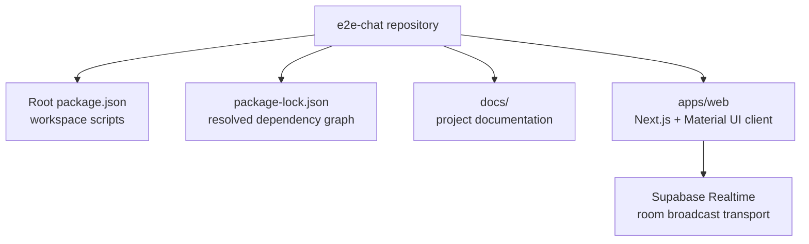
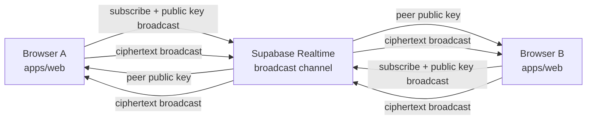
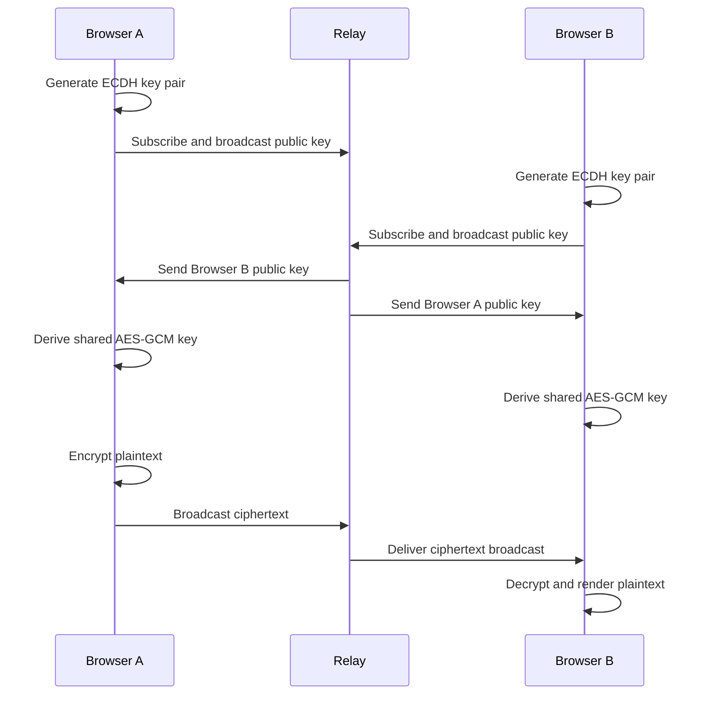

# Architecture

The repository is an npm workspaces monorepo. The root owns shared scripts and dependency installation. The current runtime is a single Next.js app with Supabase Realtime for shared room transport.

## Runtime App

`apps/web` is the user-facing chat client. It runs through Next.js and uses Material UI for layout.

The browser is responsible for all encryption and decryption. Supabase Realtime carries public keys and ciphertext between clients in the same room.

## Runtime Communication

The important boundary is between the browser and Supabase Realtime. The browser can see plaintext because it owns the user's input and local cryptographic keys. Supabase only sees room IDs, client IDs, public keys, initialization vectors, ciphertext payloads, and timestamps.

## Root Scripts

The root [package.json](../package.json) exposes the common workflow:

| Script | Purpose |
| --- | --- |
| `npm run dev` | Runs the Next.js app. |
| `npm run dev:web` | Runs only the Next.js app. |
| `npm run build` | Builds every workspace that has a `build` script. |
| `npm run lint` | Runs linting in workspaces that define linting. |
| `npm run typecheck` | Runs TypeScript checks across workspaces. |

## Data Boundaries

The app uses four important categories of data:

| Data | Created In | Sent To Supabase | Purpose |
| --- | --- | --- | --- |
| Client ID | Browser | Yes | Identifies which browser client sent a message. |
| Room ID | Browser | Yes | Groups peers into a chat room. |
| Public key | Browser | Yes | Allows peers to derive a shared key. |
| Private key | Browser | No | Used locally to derive the shared key. |
| Shared AES key | Browser | No | Encrypts and decrypts message text. |
| Plaintext message | Browser | No | The user's readable chat message. |
| Ciphertext payload | Browser | Yes | Encrypted message body relayed to peers. |

## High-Level Lifecycle

