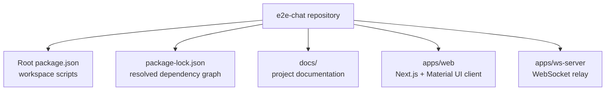
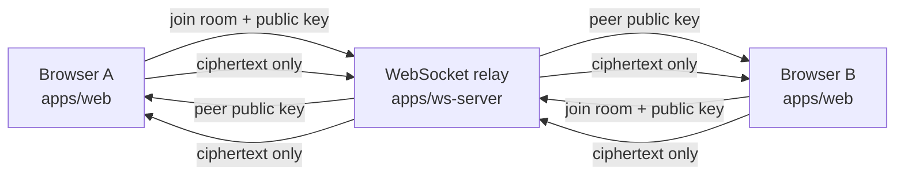
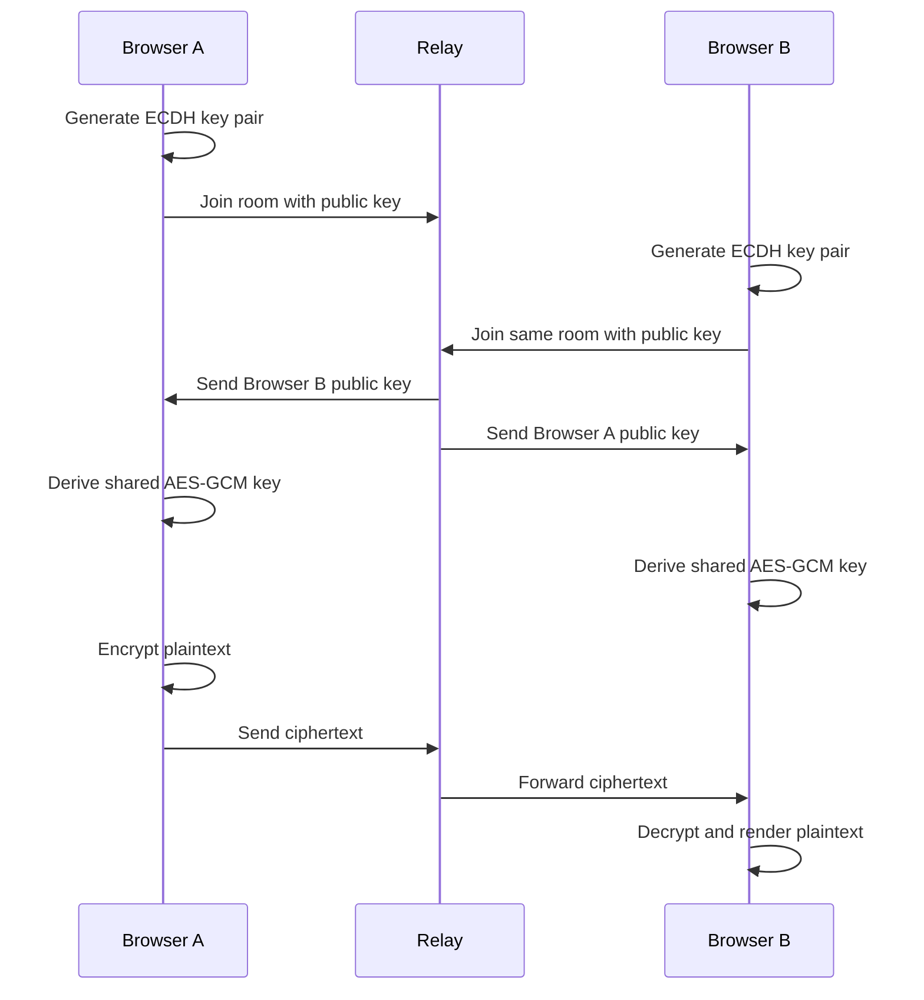

# Architecture

The repository is an npm workspaces monorepo. The root owns shared scripts and dependency installation, while each app owns its runtime code and package metadata.

## Runtime Apps

`apps/web` is the user-facing chat client. It runs in the browser through Next.js and uses Material UI for layout, forms, buttons, alerts, chips, and message surfaces. It is responsible for all encryption and decryption.

`apps/ws-server` is the relay. It accepts WebSocket connections, records which room a socket joined, exchanges public keys between clients in the same room, and broadcasts ciphertext messages. It does not decrypt messages.

## Runtime Communication

The important boundary is between the browser and the relay. The browser can see plaintext because it owns the user's input and local cryptographic keys. The relay only sees room IDs, client IDs, public keys, initialization vectors, ciphertext payloads, and timestamps.

## Root Scripts

The root [package.json](../package.json) exposes the common workflow:

| Script | Purpose |
| --- | --- |
| `npm run dev` | Runs the web app and WebSocket relay at the same time with `concurrently`. |
| `npm run dev:web` | Runs only the Next.js app. |
| `npm run dev:ws` | Runs only the WebSocket relay. |
| `npm run build` | Builds every workspace that has a `build` script. |
| `npm run lint` | Runs linting in workspaces that define linting. |
| `npm run typecheck` | Runs TypeScript checks across workspaces. |

## Data Boundaries

The app uses four important categories of data:

| Data | Created In | Sent To Relay | Purpose |
| --- | --- | --- | --- |
| Client ID | Browser | Yes | Identifies which socket sent a message. |
| Room ID | Browser | Yes | Groups peers into a chat room. |
| Public key | Browser | Yes | Allows peers to derive a shared key. |
| Private key | Browser | No | Used locally to derive the shared key. |
| Shared AES key | Browser | No | Encrypts and decrypts message text. |
| Plaintext message | Browser | No | The user's readable chat message. |
| Ciphertext payload | Browser | Yes | Encrypted message body relayed to peers. |

## High-Level Lifecycle

