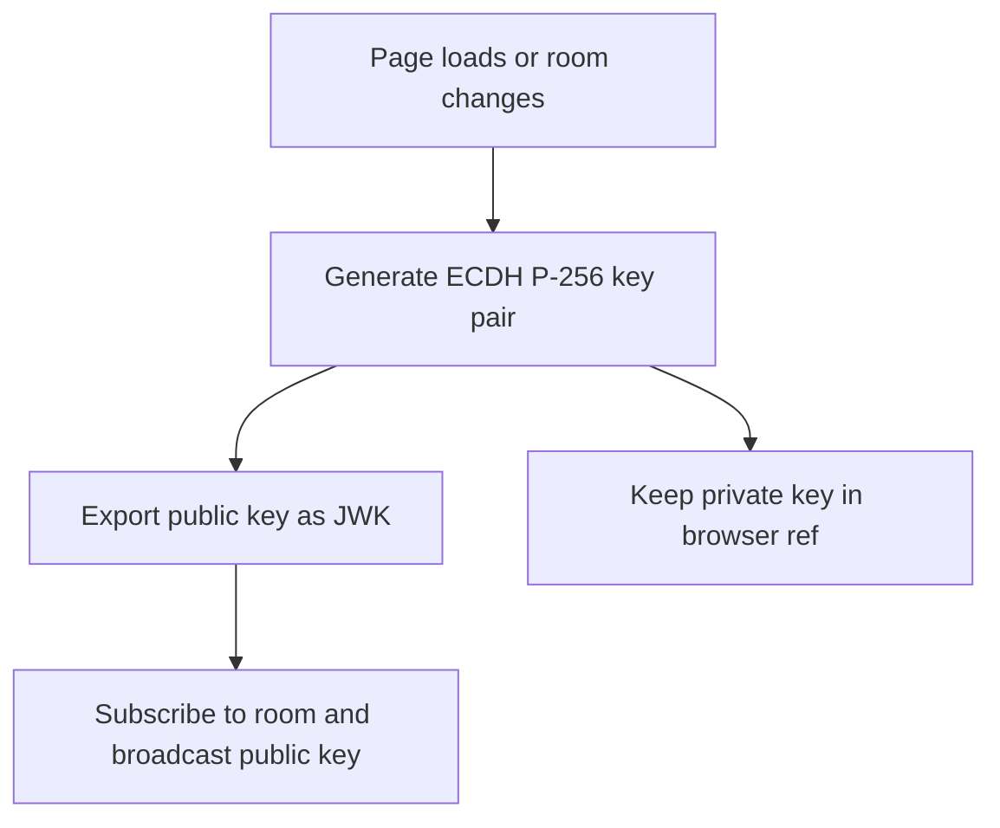
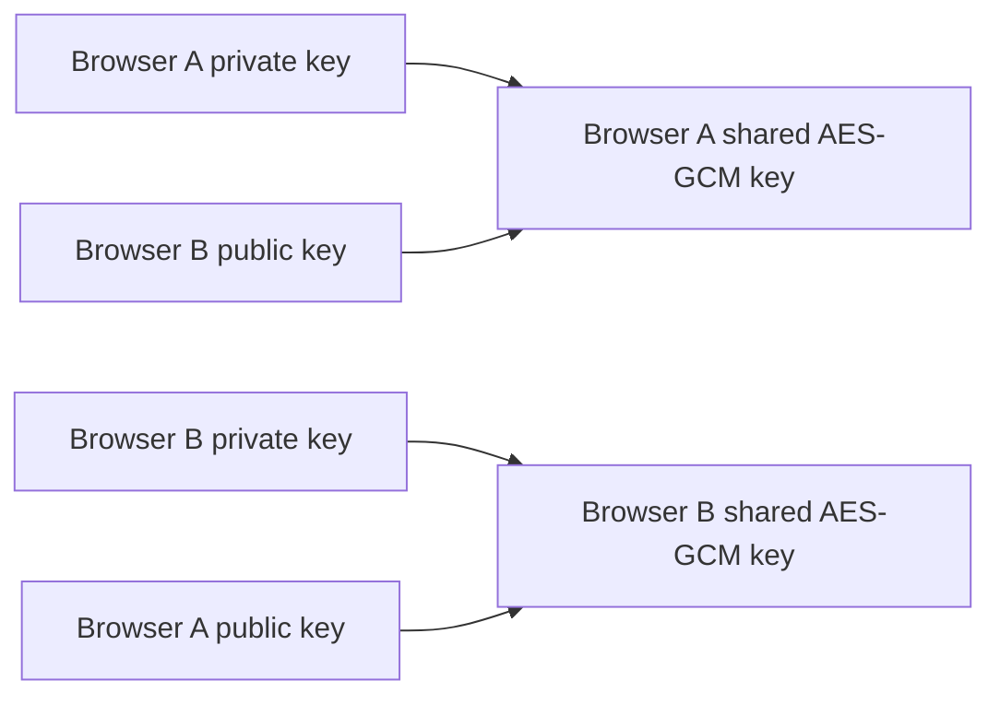
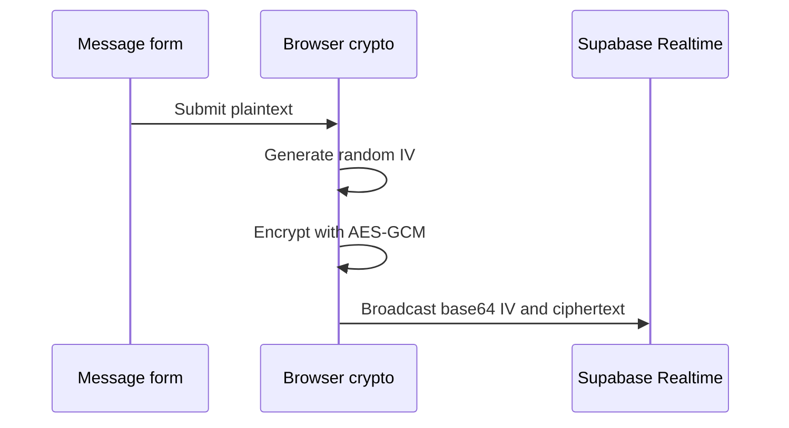
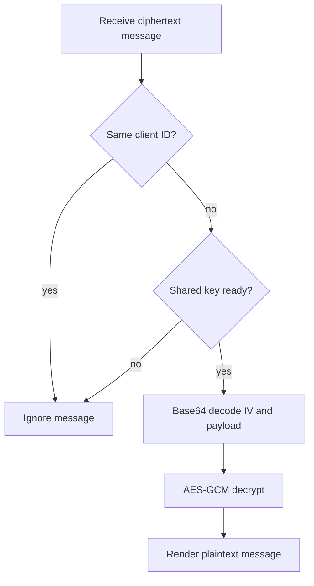

# Encryption Flow

The cryptography lives in the browser client at [apps/web/app/page.tsx](../apps/web/app/page.tsx). Supabase never receives private keys, shared keys, or plaintext messages.

## Algorithms Used

The demo uses the browser Web Crypto API:

| Step | API | Algorithm |
| --- | --- | --- |
| Key pair generation | `crypto.subtle.generateKey` | ECDH with P-256 |
| Public key export | `crypto.subtle.exportKey` | JSON Web Key |
| Peer public key import | `crypto.subtle.importKey` | JSON Web Key |
| Shared key derivation | `crypto.subtle.deriveKey` | ECDH to AES-GCM key |
| Message encryption | `crypto.subtle.encrypt` | AES-GCM 256-bit |
| Message decryption | `crypto.subtle.decrypt` | AES-GCM 256-bit |

## Key Creation

When the page connects to a room, the client calls `createIdentity()`. This generates an ECDH P-256 key pair. The public key is exported as a JSON Web Key so it can be broadcast through Supabase Realtime. The private key stays inside the browser and is stored in a React ref.

## Shared Key Derivation

When the relay tells a client about a peer, the client imports the peer's public key and combines it with its own private key. ECDH causes both browsers to derive equivalent shared secret material without sending that secret across the network. The app asks Web Crypto to output that material as a non-exportable AES-GCM key.

Both sides can now encrypt and decrypt the same conversation messages. The relay cannot derive the same key because it never receives either private key.

## Message Encryption

When the user sends a message:

1. The submit handler trims the text.
2. It confirms a shared key exists.
3. It generates a fresh 12-byte AES-GCM initialization vector.
4. It UTF-8 encodes the plaintext.
5. It encrypts the encoded text with the shared AES-GCM key.
6. It base64-encodes the initialization vector and ciphertext so they fit cleanly in JSON.
7. It broadcasts a `ciphertext` message to the Supabase room channel.
8. It appends the plaintext to the local message list as the sender's own message.

## Message Decryption

When a browser receives a `ciphertext` event from Supabase Realtime:

1. It ignores messages sent by the same `clientId`.
2. It checks that a shared key has been derived.
3. It base64-decodes the initialization vector and ciphertext.
4. It decrypts the payload with AES-GCM.
5. It UTF-8 decodes the plaintext.
6. It appends the readable message to React state.

## Why Base64 Is Used

Web Crypto returns binary data. Supabase Realtime exchanges JSON payloads. JSON cannot directly represent arbitrary bytes, so the client converts binary data into base64 strings before sending. On receive, it converts those base64 strings back into bytes before decrypting.

## Security Notes

This demo shows the central idea of end-to-end encryption, but it does not solve every security problem:

- Public keys are not authenticated, so a malicious relay could perform a man-in-the-middle attack.
- Rooms are not access-controlled.
- The same derived key is used for the lifetime of the current room session.
- There is no transcript integrity beyond AES-GCM authentication of individual ciphertexts.
- Messages are not persisted, so refreshes lose conversation history.

Those are normal next steps for turning a teaching demo into a hardened product.
