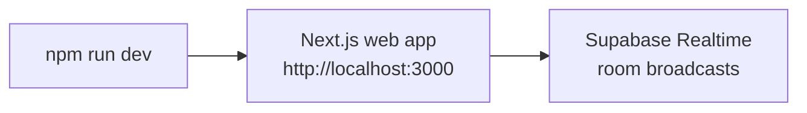
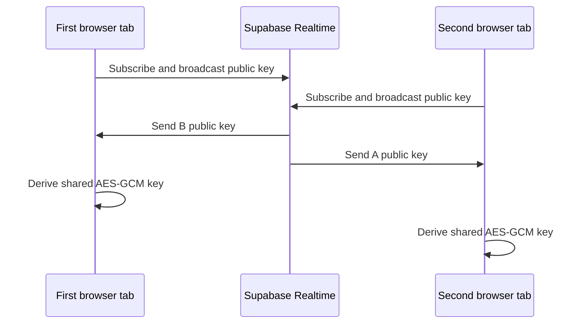
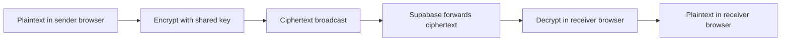

# How to Run the App

This guide is for someone opening the project for the first time. It explains what to install, which commands to run, what should appear in the terminal, and how to confirm the encrypted chat demo is working.

## What You Are Running

The application has one local service:

| Service | What It Does | Default URL |
| --- | --- | --- |
| Next.js web app | Shows the chat UI, performs encryption in the browser, and uses Supabase Realtime for room transport. | `http://localhost:3000` |

The usual command, `npm run dev`, starts the Next.js app.



## 1. Install Prerequisites

You need:

- Git.
- Node.js 20 or newer.
- npm, which is included with Node.js.
- A modern browser such as Chrome, Edge, Firefox, or Safari.

Check your installed versions:

```bash
git --version
node --version
npm --version
```

Expected result:

- `git --version` prints a Git version.
- `node --version` prints `v20.x.x` or newer.
- `npm --version` prints an npm version.

If Node.js is missing or older than version 20, install the current LTS release from [nodejs.org](https://nodejs.org/) or use your normal Node version manager.

## 2. Clone the Repository

Choose a folder where you keep source code, then clone the project:

```bash
git clone https://github.com/matthewlovestocode/e2echat.git
cd e2echat
```

You should now be in the repository root. Confirm that by listing the files:

```bash
ls
```

You should see files and folders such as:

```text
README.md
apps
docs
package.json
package-lock.json
```

## 3. Install Dependencies

Install all workspace dependencies from the repository root:

```bash
npm install
```

This installs:

- Root development tooling.
- Next.js and Material UI dependencies for `apps/web`.
- Supabase Realtime client used for room events and encrypted message sends.

The install may print funding information or audit warnings. Those messages do not prevent the app from running unless npm exits with an error.

## 4. Start the App

The repository includes default public Supabase settings for the demo. If you want to point at a different Supabase project, create a local env file for the web app:

```bash
cp apps/web/.env.example apps/web/.env.local
```

Then edit `apps/web/.env.local`. Do not put a Supabase secret key in this file because every `NEXT_PUBLIC_` value is exposed to the browser.

Run the development command from the repository root:

```bash
npm run dev
```

This starts the web app. Room messages are carried by Supabase Realtime.

You should see output like:

```text
Next.js ...
- Local: http://localhost:3000
Ready
```

Leave this terminal running. The app stays available while this command is active.

## 5. Open the Chat UI

Open this URL in a browser:

```text
http://localhost:3000
```

You should see the E2E Chat interface:

- A top bar with the app name and encryption status.
- A session panel with the room name and your client identity.
- A chat panel with an empty message area and message input.

At first, the status should indicate that the app is waiting for a peer. That is expected because end-to-end encryption needs another browser client in the same room before a shared key can be derived.

## 6. Open a Second Client

Open a second browser window or tab at the same URL:

```text
http://localhost:3000
```

Keep both clients in the same room. The first window generates a room name like `demo-1a2b3c`; use that same room name in the second window and click the join button.

Once the two clients see each other:

- Each browser exchanges a public key through Supabase Realtime.
- Each browser derives the same shared encryption key locally.
- The status changes to an encrypted or secure-session state.
- The message input becomes enabled.



## 7. Send a Test Message

In the first browser window:

1. Type a message.
2. Click Send.

In the second browser window:

1. Confirm the message appears in the chat.
2. Send a reply.

Supabase Realtime only receives encrypted payloads. The readable text is encrypted before it leaves the sending browser and decrypted after it reaches the receiving browser.



## 8. Stop the App

Go back to the terminal where `npm run dev` is running and press:

```text
Ctrl+C
```

That stops the local Next.js app.

## Troubleshooting

### `npm install` Fails

Confirm you are using Node.js 20 or newer:

```bash
node --version
```

If the version is too old, switch to a newer Node.js version and run `npm install` again.

### `localhost:3000` Does Not Load

Check the terminal running `npm run dev`.

If the web app started correctly, you should see:

```text
Local: http://localhost:3000
```

If port `3000` is already in use, Next.js may choose another port or print an error. Use the URL shown in the terminal.

### The UI Says It Is Waiting for a Peer

Open a second browser window or tab at the same URL and keep both clients in the same room. A single browser client cannot establish a chat session by itself because there is no peer public key to exchange.

### Messages Do Not Send

Check these conditions:

- The terminal running `npm run dev` still shows the Next.js server as ready.
- Both browser clients use the same room name.
- The status says the encrypted session is established.
- The message input is enabled.

### Browser Console Shows Realtime Errors

The local Next.js server may not be running, or Supabase Realtime may not be accepting the configured publishable key. Start the app with:

```bash
npm run dev
```

Then reload the browser.

### Changes Are Not Appearing

The development server usually updates automatically. If the UI looks stale:

1. Refresh the browser.
2. Stop `npm run dev` with `Ctrl+C`.
3. Start it again with `npm run dev`.

## Quick Command Reference

| Goal | Command |
| --- | --- |
| Install dependencies | `npm install` |
| Run the app | `npm run dev` |
| Run only the web app | `npm run dev:web` |
| Stop running services | `Ctrl+C` |
| Typecheck the repo | `npm run typecheck` |
| Build the repo | `npm run build` |
| Lint the repo | `npm run lint` |
