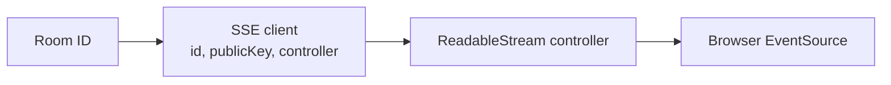
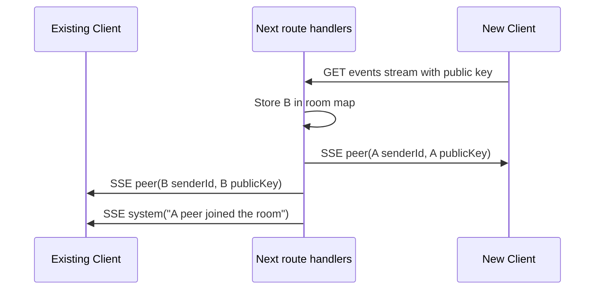
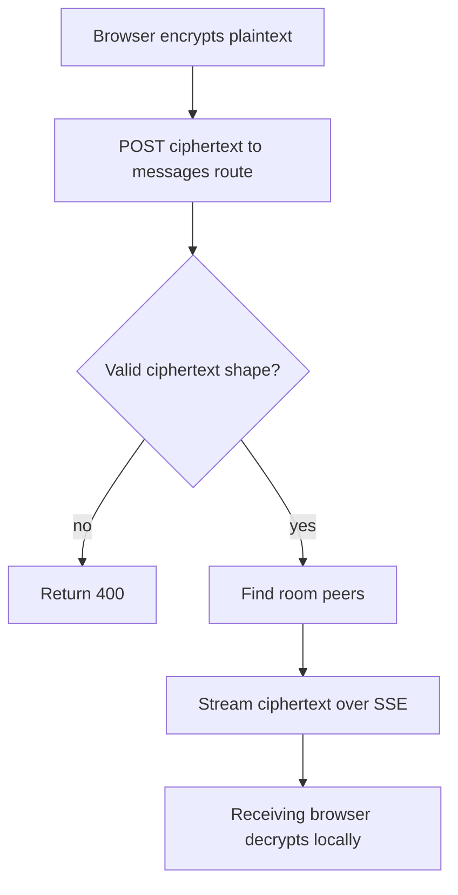
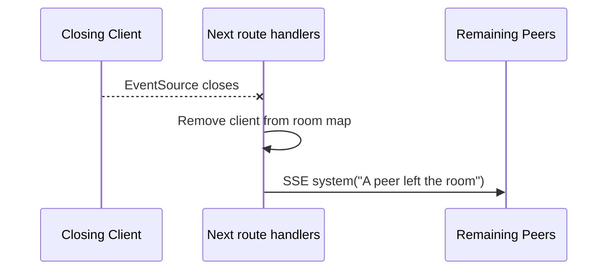

# SSE Relay

The relay now lives inside the Next.js app under [apps/web/app/api/rooms/[roomId]](../apps/web/app/api/rooms/%5BroomId%5D). It uses Server-Sent Events for receiving room events in the browser and HTTP POST for sending encrypted messages.

This keeps the project deployable as a single Vercel app. There is no separate WebSocket server process.

## Responsibilities

The route-handler relay is intentionally small. Its responsibilities are:

- Accept an SSE connection for a room.
- Track which client IDs are currently connected to that room.
- Share peer public keys with clients in the same room.
- Accept encrypted chat payloads with HTTP POST.
- Stream encrypted chat payloads to room peers over SSE.
- Notify remaining peers when someone leaves.

It does not:

- Authenticate users.
- Store messages durably.
- Decrypt messages.
- Validate public key ownership.
- Persist room state across function instances or restarts.

## Files

| File | Purpose |
| --- | --- |
| `events/route.ts` | Opens the `text/event-stream` response and registers the browser as a room client. |
| `messages/route.ts` | Accepts encrypted message POSTs and broadcasts them to connected room clients. |
| `store.ts` | Holds the in-memory room map and helper functions for SSE writes. |

## In-Memory Client Registry

The relay stores active clients in a global in-memory map:

```ts
type SseClient = {
  id: string;
  publicKey: JsonWebKey;
  controller: ReadableStreamDefaultController<Uint8Array>;
};
```

The `controller` is the open SSE stream for that browser client. When the route needs to send a message to a client, it writes an SSE frame to that controller.



## Join Flow

The browser joins a room by opening an EventSource connection:

```text
GET /api/rooms/:roomId/events?clientId=...&publicKey=...
```

The public key is included in the query string because the browser `EventSource` API only opens a GET request and does not let this app send a JSON request body.



This exchange gives each browser enough public key material to derive its local shared key.

## Ciphertext Flow

After a client has derived a shared key, it sends encrypted chat messages with HTTP POST:

```text
POST /api/rooms/:roomId/messages
```

The route validates that the message has the expected ciphertext shape, then broadcasts the message to all other connected clients in the room.



The route does not inspect or transform the `iv` or `payload`. They are already encrypted browser output.

## Close Flow

When the browser closes the EventSource connection, the request signal aborts. The route removes the client from the in-memory room map and broadcasts a system message to remaining peers.



## Vercel Testing Caveat

This relay is appropriate for a small Vercel test deployment because it removes the need for a separate WebSocket server. The in-memory room map is not a production coordination layer. A production deployment should use a shared pub/sub or realtime backend if messages need to work across multiple function instances, regions, cold starts, or restarts.
