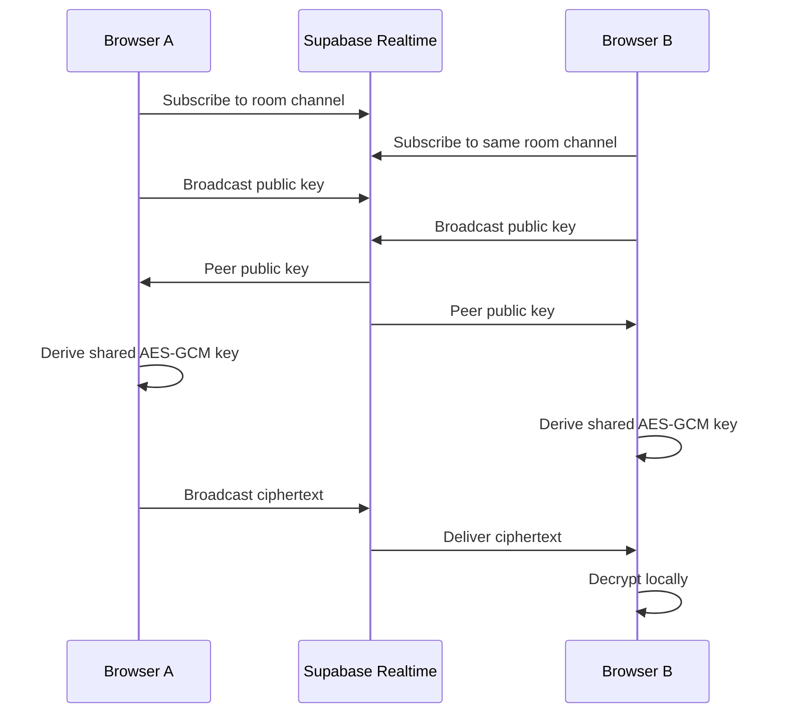

# Supabase Realtime

The chat uses Supabase Realtime Broadcast as the shared room transport. This replaced the earlier in-memory SSE route-handler relay because Vercel can run different requests on different function instances.

The browser still performs all encryption and decryption. Supabase only receives room names, client IDs, public keys, initialization vectors, ciphertext payloads, and timestamps.

## Configuration

The client reads:

```bash
NEXT_PUBLIC_SUPABASE_URL
NEXT_PUBLIC_SUPABASE_PUBLISHABLE_KEY
```

The current defaults point at:

```text
https://detutdxfzmictmjctfyf.supabase.co
```

The checked-in demo defaults use the current Supabase project. To override them locally, copy the app-level env example:

```bash
cp apps/web/.env.example apps/web/.env.local
```

Then edit `apps/web/.env.local`. Configure the same variables in Vercel.

## Flow



## Why This Works on Vercel

Local in-memory state works in `next dev` because one Node process holds every connected client. Vercel can split requests across multiple function instances, so memory is not a reliable room registry.

Supabase Realtime is external shared infrastructure. Both local and deployed clients join the same Supabase channel, so they can find peers even when the Next.js app is deployed on Vercel.

## Security Boundary

The Supabase publishable key is public by design. Do not use the Supabase secret key in browser code.

The secret key is not required for this chat flow.
