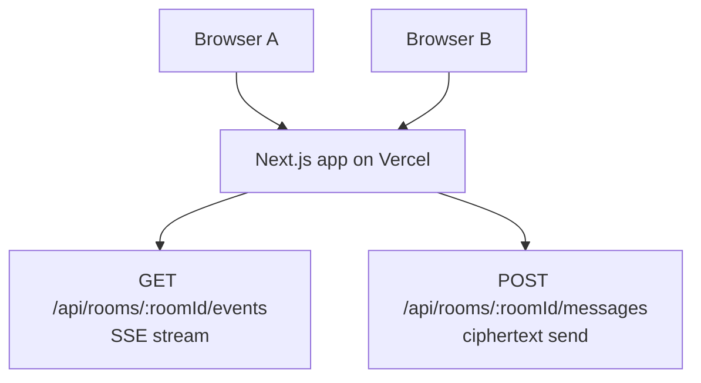

# Vercel Deployment

The app is now designed to deploy to Vercel as a single Next.js project. It does not require a separate WebSocket server.

## What Runs on Vercel

The browser still performs all encryption and decryption. Vercel hosts the static UI and the dynamic route handlers used for room events.

## Deploy From GitHub

1. Push `main` to GitHub.
2. Open Vercel and import `https://github.com/matthewlovestocode/e2echat`.
3. Use the repository root as the project root.
4. Keep the default framework preset as Next.js.
5. Deploy.

No environment variables are required for the current local-room demo.

## Test the Deployment

After Vercel gives you a deployment URL:

1. Open the URL in one browser window.
2. Open the same URL in a second browser window.
3. Keep both windows in the same room.
4. Wait for the status to show that encryption is ready.
5. Send a message in one window and confirm it appears in the other.

## Important Limits

This Vercel deployment mode is meant for testing the demo. It uses an in-memory room map inside the running function instance.

That means:

- Room state can disappear on cold starts or restarts.
- Clients connected to different function instances may not see each other.
- Long SSE streams are limited by Vercel Function duration limits.
- Message history is not stored.

For a production chat system, keep the browser-side encryption model but replace the in-memory relay with a shared realtime backend such as Redis pub/sub, a durable queue, or a hosted realtime service.
