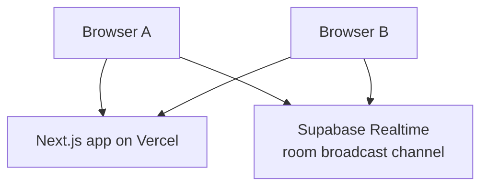

# Vercel Deployment

The app is designed to deploy to Vercel as a single Next.js project. It does not require a separate WebSocket server, and room transport is handled by Supabase Realtime.

## What Runs on Vercel



The browser still performs all encryption and decryption. Vercel hosts the UI; Supabase Realtime carries public keys and ciphertext between room clients.

## Deploy From GitHub

1. Push `main` to GitHub.
2. Open Vercel and import `https://github.com/matthewlovestocode/e2echat`.
3. Use the repository root as the project root.
4. Keep the default framework preset as Next.js.
5. Add the Supabase environment variables.
6. Deploy.

Required environment variables:

```bash
NEXT_PUBLIC_SUPABASE_URL=https://detutdxfzmictmjctfyf.supabase.co
NEXT_PUBLIC_SUPABASE_PUBLISHABLE_KEY=<publishable key>
```

Do not add the Supabase secret key to Vercel for this app. The browser only needs the publishable key for Realtime Broadcast.

## Test the Deployment

After Vercel gives you a deployment URL:

1. Open the URL in one browser window.
2. Open the same URL in a second browser window.
3. Keep both windows in the same room.
4. Wait for the status to show that encryption is ready.
5. Send a message in one window and confirm it appears in the other.

## Important Limits

Realtime delivery depends on the Supabase Realtime project being enabled and accepting public broadcast channels.

That means:

- Message history is not stored.
- Broadcast delivery is realtime and ephemeral.

For a production chat system, keep the browser-side encryption model and add authentication, key verification, and optional encrypted persistence.
