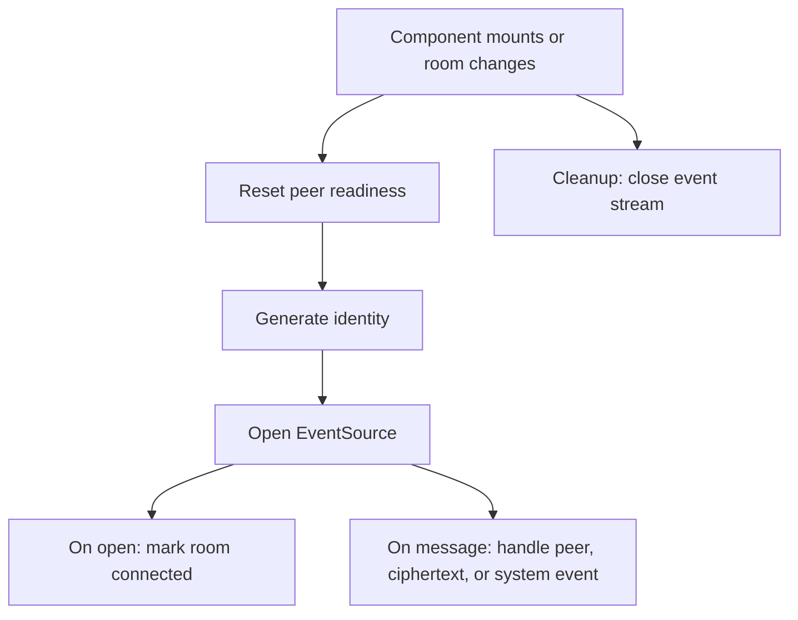
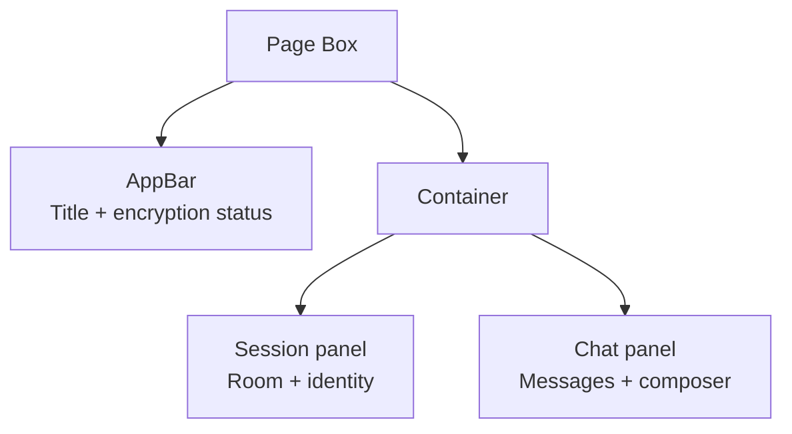

# Web App

The web app lives in [apps/web](../apps/web). It is a Next.js App Router application with a single main page at [apps/web/app/page.tsx](../apps/web/app/page.tsx).

## File Map

| File | Purpose |
| --- | --- |
| `app/layout.tsx` | Defines the root HTML shell, Material UI cache provider, theme provider, and CSS reset. |
| `app/page.tsx` | Contains the chat UI, SSE connection, key exchange, encryption, decryption, HTTP sends, and message state. |
| `app/api/rooms/[roomId]/events/route.ts` | Opens the SSE stream for a room and announces peer public keys. |
| `app/api/rooms/[roomId]/messages/route.ts` | Accepts encrypted message POSTs and relays them to room peers. |
| `app/api/rooms/[roomId]/store.ts` | Holds in-memory room membership and SSE controllers. |
| `app/theme.ts` | Defines the Material UI theme used by the app. |
| `app/globals.css` | Provides small global CSS defaults. |
| `eslint.config.mjs` | Configures ESLint with Next.js core web vitals rules. |
| `next.config.ts` | Holds Next.js configuration. |
| `tsconfig.json` | Holds TypeScript configuration. |

## Why `page.tsx` Is a Client Component

The top of `page.tsx` contains `"use client";` because the page depends on browser-only APIs:

- `EventSource`
- `crypto.subtle`
- `crypto.randomUUID`
- `btoa`
- `atob`
- `navigator.clipboard`

Those APIs do not run during server rendering. Marking the file as a client component tells Next.js to run the interactive logic in the browser.

## State and Refs

The page uses React state for values that affect rendering:

| State | Purpose |
| --- | --- |
| `roomId` | The active room connected through the SSE relay. |
| `draftRoomId` | The editable room field before the user joins a new room. |
| `text` | The current message input. |
| `messages` | The rendered chat transcript. |
| `status` | Human-readable connection or encryption status. |
| `peerReady` | Whether a peer key has been received and a shared key is available. |
| `clientId` | A per-tab identifier used to ignore echoed messages and label the client. |

The page uses refs for mutable objects that should not cause rerenders:

| Ref | Purpose |
| --- | --- |
| `privateKeyRef` | Holds the local ECDH private key. |
| `sharedKeyRef` | Holds the derived AES-GCM key. |
| `messagesEndRef` | Keeps the latest message scrolled into view. |

## Connection Effect

The main `useEffect` runs when the component mounts or when `roomId` changes. It does four jobs:

1. Reset peer readiness and shared-key state.
2. Generate a fresh local ECDH identity.
3. Open an `EventSource` connection to the room events route.
4. Register handlers for `open`, `message`, and `error`.



The cleanup step matters because changing rooms should close the previous event stream. Without cleanup, one browser tab could accidentally remain subscribed to multiple rooms.

## Message Handling

The EventSource `message` handler expects the relay to send one of these message types:

| Type | Meaning |
| --- | --- |
| `peer` | A peer in the room has shared its public key. The client derives a shared AES-GCM key. |
| `ciphertext` | A peer sent an encrypted chat message. The client decrypts and renders it. |
| `system` | The relay sent a room event such as a peer joining or leaving. |

The browser ignores messages whose `senderId` matches its own `clientId`. That prevents a client from rendering its own relayed message twice.

## UI Layout

Material UI provides the visual structure:



The left session panel shows connection status, room controls, and the current client ID. The main chat panel shows the transcript and the message composer. The send field is disabled until a peer key has been received and the shared key is ready.

## Sending Messages

The browser sends encrypted messages with `fetch`:

```text
POST /api/rooms/:roomId/messages
```

The payload contains the sender ID, timestamp, AES-GCM initialization vector, and ciphertext payload. It does not contain the plaintext message.
