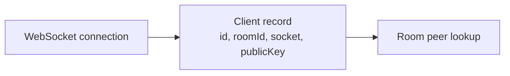
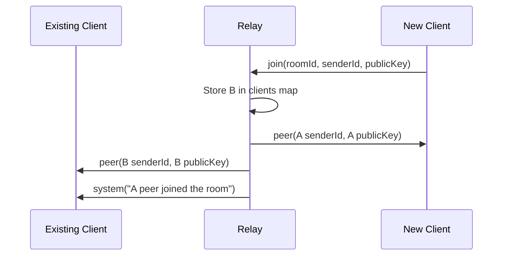
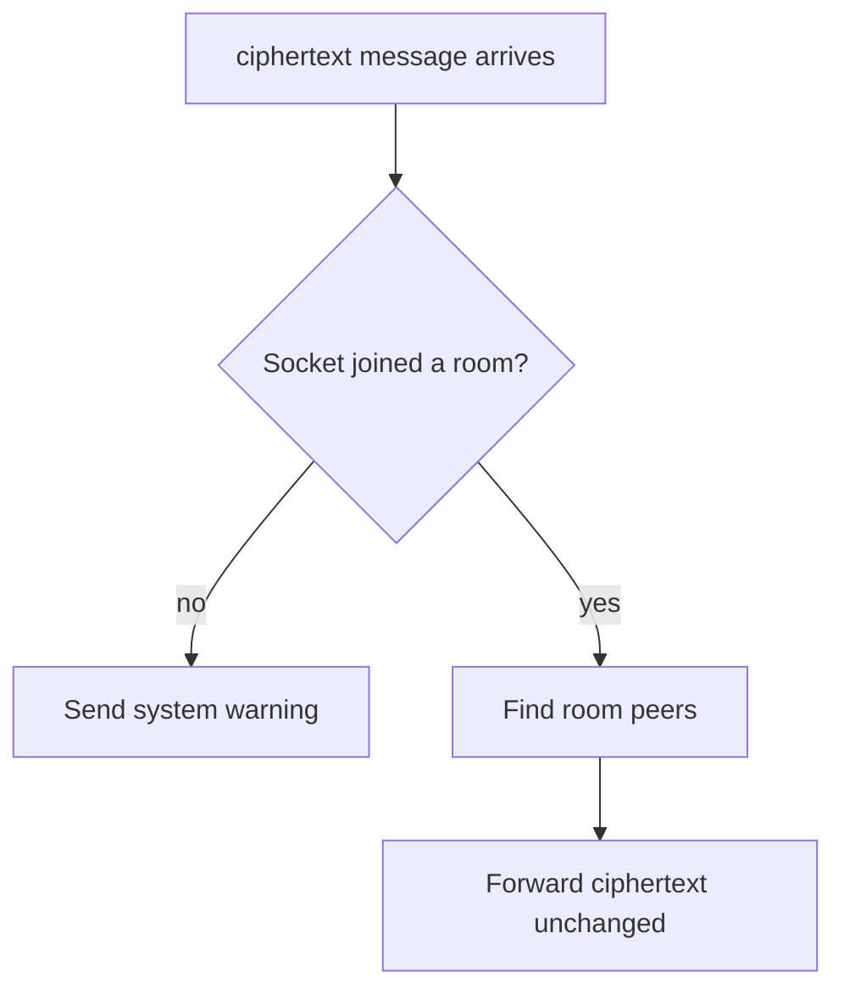
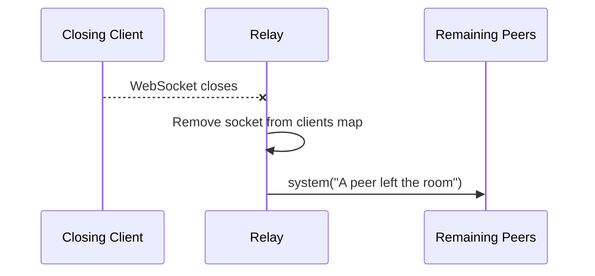

# WebSocket Relay

The WebSocket relay lives in [apps/ws-server/src/index.ts](../apps/ws-server/src/index.ts). It uses the `ws` package to accept WebSocket clients and forward messages between clients in the same room.

## Responsibilities

The relay is intentionally small. Its responsibilities are:

- Listen for WebSocket connections.
- Accept `join` messages from clients.
- Track which socket belongs to which room.
- Share peer public keys with clients in the same room.
- Broadcast encrypted chat payloads to room peers.
- Notify remaining peers when someone leaves.

It does not:

- Authenticate users.
- Store messages.
- Decrypt messages.
- Validate public key ownership.
- Persist room state.

## In-Memory Client Registry

The relay stores active clients in a `Map<WebSocket, Client>`.

```ts
type Client = {
  id: string;
  roomId: string;
  socket: WebSocket;
  publicKey: unknown;
};
```

The socket is the map key because it uniquely represents a live connection. The value stores the client ID, room ID, socket, and public key sent by the browser.



## Join Flow

When a client sends a `join` message, the relay stores that socket as a room member. It then loops over existing peers in the same room and exchanges public keys:

- The new client receives each existing peer's public key.
- Each existing peer receives the new client's public key.



This exchange gives each browser enough public key material to derive its local shared key.

## Ciphertext Flow

After a client has joined, it may send a `ciphertext` message. The relay finds the sender's room and broadcasts that same payload to every other client in that room.



The relay does not inspect or transform the `iv` or `payload`. They are already encrypted browser output.

## Close Flow

When a socket closes, the relay removes it from the client map. If that socket had joined a room, the relay broadcasts a system message to the remaining room peers.



## Message Types

The relay currently accepts two inbound message shapes:

```ts
type IncomingMessage =
  | { type: "join"; roomId: string; senderId: string; publicKey: unknown }
  | { type: "ciphertext"; senderId: string; iv: string; payload: string; sentAt: string };
```

The relay sends these outbound message shapes:

| Type | Recipient | Purpose |
| --- | --- | --- |
| `peer` | Room members | Share a peer's public key. |
| `ciphertext` | Room peers | Forward encrypted chat messages. |
| `system` | One client or room peers | Report malformed messages or room events. |

## Operational Notes

The default relay port is `3001`. Set `PORT` to change it:

```bash
PORT=8080 npm run dev:ws
```

If the relay port changes, the web app also needs `NEXT_PUBLIC_WS_URL` to point to the new WebSocket URL.
